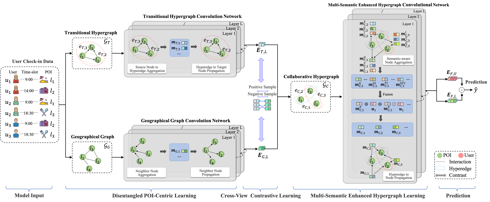

# ICASSP2024_ASTHL

The official PyTorch implementation for [Adaptive Spatial-Temporal Hypergraph Fusion Learning for Next POI Recommendation](https://ieeexplore.ieee.org/abstract/document/10447357/), which is accepted to ICASSP'2024.

If you have any questions, please feel free to issue or contact me by email. If you use our codes and datasets in your research, please cite:
```
@inproceedings{lai2024adaptive,
  title={Adaptive Spatial-Temporal Hypergraph Fusion Learning for Next POI Recommendation},
  author={Lai, Yantong and Su, Yijun and Wei, Lingwei and Wang, Tianci and Zha, Daren and Wang, Xin},
  booktitle={ICASSP 2024-2024 IEEE International Conference on Acoustics, Speech and Signal Processing (ICASSP)},
  pages={7320--7324},
  year={2024},
  organization={IEEE}
}
```


## Overview
Next point-of-interest (POI) recommendation has been a trending task to provide next POI suggestions. Most existing sequential-based and graph-based methods have endeavored to model user visiting behaviors and achieved considerable performances. However, they have either modeled user interests at a coarse-grained interaction level or ignored complex high-order feature interactions through general heuristic message passing scheme, making it challenging to capture complementary effects. To tackle these challenges, we propose a novel framework Adaptive Spatial-Temporal Hypergraph Fusion Learning (ASTHL) for next POI recommendation. Specifically, we design disentangled POI-centric learning to decouple spatial-temporal factors and utilize cross-view contrastive learning to enhance the quality of POI representations. Furthermore, we propose multi-semantic enhanced hypergraph learning to adaptively fuse spatial-temporal factors through well-designed aggregation and propagation scheme. Extensive experiments on three real-world datasets validate the superiority of our proposal over various state-of-the-arts.





## Requirements
```
torch==1.12.0
```


